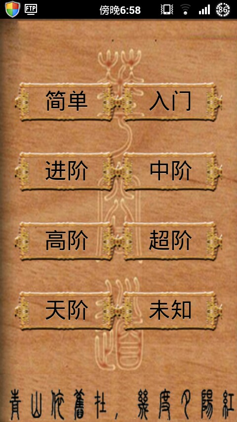

# Aklotski
智取华容道Android实现

华容道是古老的汉族民间益智游戏;

游戏玩法非常简单,只需点击棋子，要将曹操的图片从初始位置移到最下方中部的位置(华容道出口)。

规则简单，变换无穷。本游戏按照难易度，内置了400多个关卡;

## [Desc](https://happy123.me/blog/2015/03/03/huarongdao/)

多年前的一个Android小游戏实现，整理老代码的时候发现了；

优点是逻辑非常简单，没有任何过分权限要求，运行飞快，这大概是我手机里最干净的一个APP了。

## Release:

* GooglePlay:

https://play.google.com/store/apps/details?id=me.happy123.aklotski

* 百度应用地址:

http://shouji.baidu.com/game/item?docid=7547918

